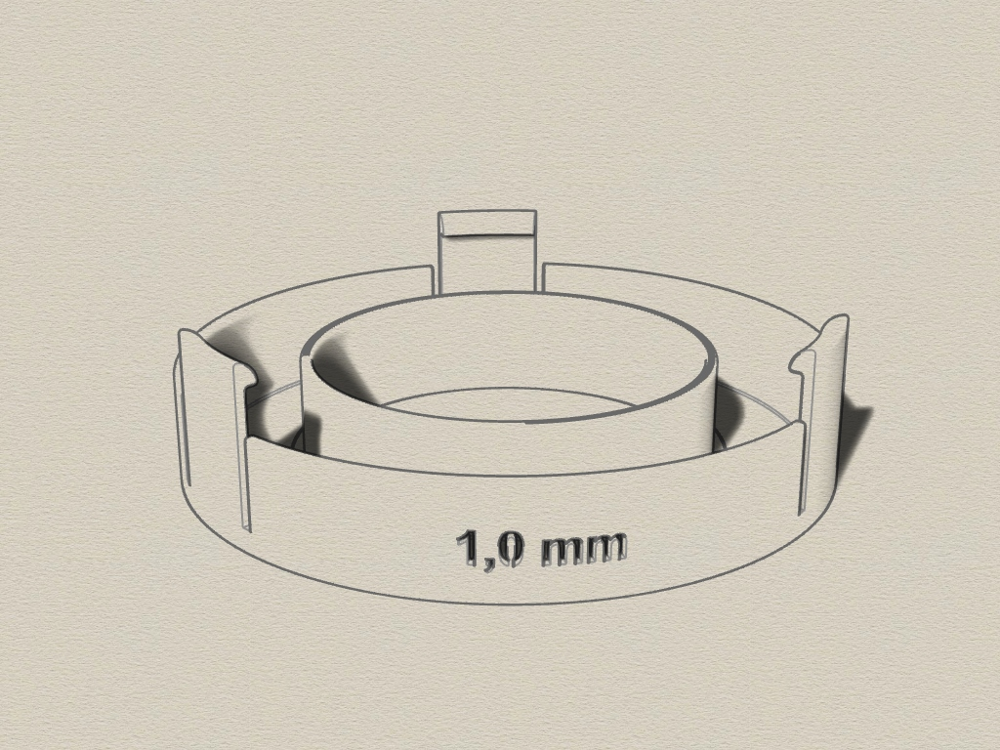

# Diffuser for Microscope Ringlight
3D-printable Diffuser for Microscope Ringlight (created with Rhino 6)

## 3D Ringlight Diffuser

The Diffuser consist of a single part that can be clipped onto the ringlight.

I use the microscope-camera to examine electronic components or for micro soldering of very small parts. 
The bright white ringlight is too bright and reflects on the soldering edges or on the PCB surface. 
To make the light shine softer I constructed this diffuser. 

There are 10 different Versions for diffuser-brightness 0,1 mm - 1,0 mm.

## Ringlight 
* Inner diameter: approx. 61 mm
* Outer diameter: approx. 94 mm
* Clip height outside: approx. 21 mm

##### Requirements:
* 3D printer 
* Filament of your choice

## View

